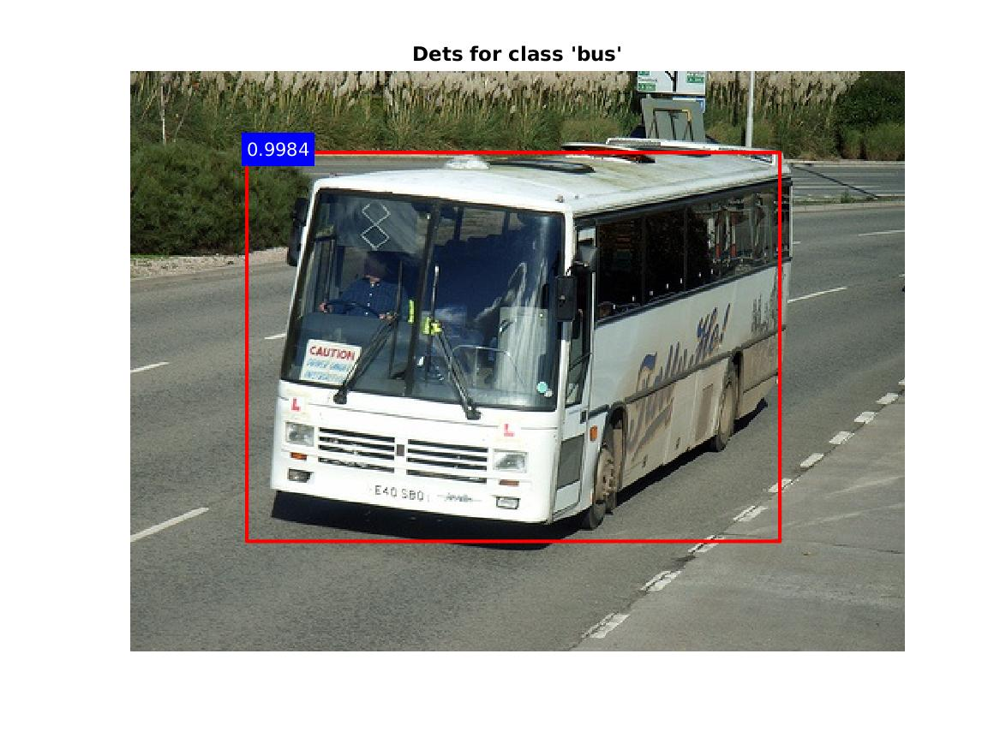

Faster R-CNN
---

This directory contains code to evaluate the Faster R-CNN object detector 
described in the paper:

```
Faster R-CNN: Towards Real-Time Object Detection with Region Proposal Networks,
Shaoqing Ren and Kaiming He and Ross Girshick and Jian Sun,
Advances in Neural Information Processing Systems (NIPS), 2015
```

This code is based on the `py-caffe` implementation 
[made available](https://github.com/rbgirshick/py-faster-rcnn) by 
[Ross Girshick](http://www.rossgirshick.info/) and the MatConvNet 
[Fast R-CNN implementation](https://github.com/vlfeat/matconvnet/tree/master/examples/fast_rcnn) by 
[Hakan Bilen](http://www.robots.ox.ac.uk/~hbilen).

The pre-trained models released with the caffe code which have been imported into matconvnet and 
can be downloaded [here](http://www.robots.ox.ac.uk/~albanie/models.html#faster-rcnn-models), together with models trained directly with this code.  Alternatively, you can train your own detector.

NOTE: The training code is still in the verfication process.

### Demo

Running the `faster_rcnn_demo.m` script will download a model trained on pascal voc 2007 data and run it on a sample image to produce the figure below:



### Dependencies

To simply run a detector in test mode, there are no additional dependencies.  If you wish to train a new detector or improve detection efficiency, the following modules are required (these can be installed with `vl_contrib`):

* [autonn](https://github.com/vlfeat/autonn) - a wrapper module for matconvnet
* * [QReLU](https://github.com/albanie/mcnQRelu) - a CUDA-based ReLU implementation
* * [GPU NMS](https://github.com/albanie/mcnNMS) - a CUDA-based implementation of non-maximum supression
*
* ### Detector Evaluation
*
* There are scripts to evaluate models on the `pascal voc` and `ms coco` datasets (the scores produced by the pretrained models are listed on the [model page](http://www.robots.ox.ac.uk/~albanie/models.html#faster-rcnn-models)). Training code will be added when the original experiments have been reproduced.
*
* ### Performance
*
* The Faster R-CNN pipeline makes heavy use of non-maximum suppression during training and inference. As a result, the runtime of the detector is significantly affected by the efficiency of the NMS function.  A GPU version of non-maximum suppression can be found [here](https://github.com/albanie/mcnNMS), which can be compiled and added to your MATLAB path.  Approximate benchmarks of the code are given below on a Tesla M40 with a single item batch size:
*
* | mode      | NMS (CPU) | NMS (GPU) |
* |-----------|-----------|-----------|
* | training  | 1.1 Hz    | 3.1 Hz    |
* | inference | 6.5 Hz    | 7.5 Hz    |
*
* Running the detector with on multiple GPUs produces a significant speed boost 
* during inference, but currently only a minimal improvement during training 
* (this may be addressed in future). 
*
* Multi-GPU code performance:
*
* | mode      | Single GPU | 2 GPUs   |
* |-----------|-----------|-----------|
* | training  | 3.1 Hz    | 3.7 Hz    |
* | inference | 7.5 Hz    | 15 Hz     |
